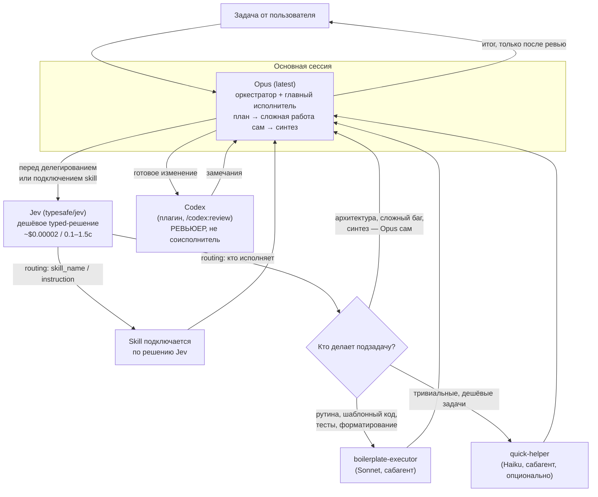

# Opus + Jev + Codex — мультиагентная оркестрация в Claude Code

Готовый рецепт настройки многоагентной работы в **Claude Code**, где:

- **Opus (последняя версия)** — одновременно **оркестратор и главный исполнитель**: сам планирует, сам делает архитектурно значимую и сложную работу, сам синтезирует результат;
- **способные, но более дешёвые модели** (Sonnet, при желании Haiku) в виде сабагентов делают всё остальное — рутину, шаблонный код, тесты, форматирование;
- **Codex** подключён как **ревьюер**, а не как равноправный соисполнитель — проверяет готовые изменения независимым взглядом *после* того, как Opus их сделал;
- **Jev** (TypeSafe `System One`, decision-модель, доступна через OpenRouter) используется в двух местах ради экономии токенов:
  1. **маршрутизация моделей** — дешёвое (~$0.00002, 0.1–1.5 c) решение "кто выполняет эту подзадачу: Opus сам / Sonnet / Haiku", вместо того чтобы дорогая модель тратила reasoning на этот выбор;
  2. **маршрутизация skills** — вместо того чтобы держать в контексте оркестратора описания всех доступных skills, один дешёвый вызов Jev решает, какой skill (если вообще какой-то) подключить под конкретный запрос.

Это адаптация схемы "Fable-оркестратор + сабагенты + Codex" под другой набор ролей: здесь дорогая модель не только планирует, но и исполняет сложную часть сама, Codex понижен до ревьюера, и добавлен отдельный дешёвый слой принятия решений (Jev) для маршрутизации моделей и skills.

---

## 1. Архитектура



Ключевое отличие от классической схемы "Fable как чистый оркестратор + Opus/Sonnet как сабагенты + Codex как peer":

| | Fable-схема (для справки) | Эта схема (Opus + Jev + Codex) |
|---|---|---|
| Кто оркестрирует | Fable (max reasoning) | Opus (latest) |
| Кто выполняет сложную работу | Сабагент Opus | **Сам оркестратор (Opus)** |
| Кто выполняет рутину | Сабагент Sonnet | Сабагент Sonnet (+ опц. Haiku) |
| Роль Codex | Peer, второе независимое мнение на этапе принятия решения | **Ревьюер** готового кода, после факта |
| Маршрутизация "кто делает" | Решает сама дорогая модель (промптом в CLAUDE.md) | Решает **Jev** — дешёвый typed-decision вызов |
| Маршрутизация skills | Обычный автоматический матчинг Claude Code по `description` | Дополнительно — **Jev-skill-router**, чтобы не держать все описания skills в контексте |

---

## 2. Роли и модели

| Роль | Модель | Где живёт | Задача |
|---|---|---|---|
| Оркестратор + главный исполнитель | **Opus**, последняя версия (например `claude-opus-5-5` — сверяйте актуальный id через `/model`) | основная сессия | Планирует, декомпозирует, **сам делает** архитектурно значимую / сложную / неоднозначную работу, синтезирует финальный результат |
| `boilerplate-executor` | Sonnet | сабагент, `~/.claude/agents/` | Шаблонный код, тесты, форматирование, механические правки |
| `quick-helper` (опционально) | Haiku | сабагент, `~/.claude/agents/` | Тривиальные дешёвые задачи: поиск по коду, короткие однострочные правки, суммаризация |
| Codex | внешний движок OpenAI, плагин `codex` для Claude Code | `/codex:review`, `/codex:adversarial-review` | **Только ревью** готовых изменений Opus — независимый взгляд, поиск багов/уязвимостей/упущений. Не пишет код, не равноправный соисполнитель |
| Jev | `typesafe/jev-*` через OpenRouter (`System One`, typed decision model) | CLI `jev-skill-router` + отдельный shell-скрипт для маршрутизации моделей | 1) выбор, кто исполняет подзадачу; 2) выбор, какой skill подключить; 3) (опционально) гейтинг рискованных вызовов инструментов |

> Jev — это **не** LLM в привычном смысле: он не генерирует текст, а возвращает typed-ответ (choice / score / probability) с калиброванной уверенностью за ~100–1500 мс и на порядки дешевле обычного LLM-вызова. Поэтому он годится именно для routing/triage/gating, а не для содержательной работы.

---

## 3. Предварительные требования

- Установленный и обновлённый Claude Code (`claude doctor` — проверить версию и автообновление).
- Доступ к моделям Opus (latest) и Sonnet (и опционально Haiku) в вашем аккаунте.
- Node.js + npm (нужен для `jev-skill-router` и для Codex CLI).
- Аккаунт и API-ключ **OpenRouter** — https://openrouter.ai/keys (для Jev).
- Установленный `codex` CLI отдельно от Claude Code и логин в нём (для ревью).

---

## 4. Установка шаг за шагом

### 4.1 Модель Opus как основная

```
claude doctor
/model            → выбрать Opus (последнюю доступную версию)
/effort max       → держать max reasoning только на этапе планирования
```

Закрепить на уровне проекта в `.claude/settings.json` (см. готовый пример `templates/settings.json.example` в этом репозитории):

```json
{
  "model": "claude-opus-5-5"
}
```

> Известный баг: встроенное расширение Claude Code для VS Code может игнорировать `model` в project-level `settings.json`. Надёжнее всего это работает через CLI-терминал; если не срабатывает — переключайте `/model` вручную или запускайте `claude` из терминала внутри VS Code.

### 4.2 Сабагенты (глобально, один раз для всех проектов)

Кладутся в `~/.claude/agents/`, а не в `.claude/agents/` внутри проекта — тогда доступны сразу везде. Готовые файлы лежат в `templates/agents/` этого репозитория — скопируйте их:

```bash
mkdir -p ~/.claude/agents
cp templates/agents/boilerplate-executor.md ~/.claude/agents/
cp templates/agents/quick-helper.md ~/.claude/agents/
```

Формат файла — Markdown с YAML frontmatter:

```markdown
---
name: boilerplate-executor
description: Use for mechanical tasks, boilerplate, tests, formatting, simple
  edits. Execute efficiently, without unnecessary re-reasoning.
tools: Read, Write, Edit, Glob, Grep, Bash
model: sonnet
---

You execute clearly-scoped mechanical work delegated by the orchestrator.
Do not re-plan or re-scope the task — follow the instructions given, produce
the change, and return a concise summary of what changed.
```

> Проверяйте фактическое `name:` в получившемся файле — Claude Code иногда создаёт агента не под тем именем, которое вы задумали. Если в CLAUDE.md ссылаетесь на агента по имени — оно должно совпадать один в один с `name` во frontmatter.

### 4.3 Codex — как ревьюер, а не соисполнитель

Сначала сам движок (отдельно от Claude Code):

```bash
npm install -g @openai/codex
codex login
```

Затем плагин-мост в Claude Code:

```
/plugin marketplace add openai/codex-plugin-cc
/plugin install codex@openai-codex
/reload-plugins        ← обязательно, иначе команды /codex:* не появятся
/codex:setup            ← должно показать "Codex is ready"
```

В этой схеме Codex вызывается **только** для ревью, а не для параллельной работы над задачей:

```
/codex:review                 # обычное ревью текущих изменений
/codex:adversarial-review     # более скептичное ревью для критичных изменений
```

Команду `/codex:rescue` (делегирование Codex как равноправному исполнителю) в этой схеме **не используем** — это сознательное отличие от peer-схемы: Codex здесь всегда работает post-hoc, над уже готовым изменением Opus.

### 4.4 Jev — маршрутизация моделей и skills

**Ключ доступа:**

```bash
export OPENROUTER_API_KEY=sk-or-v1-...
```
(сохраните в `~/.zshrc` / `~/.bashrc` / менеджере секретов вашей ОС — не коммитьте ключ в репозиторий).

**4.4.1 Маршрутизация skills — готовый инструмент**

Используем готовый CLI [`jev-skill-router`](https://github.com/aleksvega/jev-skill-router): вместо того, чтобы оркестратор держал в контексте описания всех подключённых skills, один дешёвый Jev-вызов решает, какой skill (если вообще нужен) подключить под конкретный запрос.

```bash
npm install -g jev-skill-router
jev-skill-router --init claude   # готовит интеграцию под Claude Code
```

Инструмент сам сканирует `~/.claude/skills`, `./skills` в проекте и извлекает `name`/`description` из frontmatter `SKILL.md`. Пример вызова и ответа:

```bash
$ jev-skill-router "add caching to /search endpoint with Redis"
{"complexity":3.05,"use_skill":false,"skill_name":null,
 "instruction":"No specialized skill needed; proceed with the request directly.",
 "confidence":2.19}
```

**4.4.2 Маршрутизация моделей — тонкая обёртка**

`jev-skill-router` заточен под выбор skill, а не под выбор "кто исполняет подзадачу". Для этого используем отдельный небольшой скрипт — `templates/scripts/jev-route.sh`, который дёргает Jev Decisions API напрямую:

```bash
#!/usr/bin/env bash
# templates/scripts/jev-route.sh — Jev-решение: кто исполняет подзадачу
set -euo pipefail

TASK="$1"

curl -sS https://openrouter.ai/api/alpha/decisions \
  -H "Authorization: Bearer ${OPENROUTER_API_KEY:?set OPENROUTER_API_KEY}" \
  -H "Content-Type: application/json" \
  -d "$(cat <<JSON
{
  "model": "typesafe/jev-1.13",
  "question": {
    "type": "choice",
    "options": ["opus-self", "boilerplate-executor", "quick-helper"],
    "text": "Who should execute this subtask: the orchestrator itself (complex/architectural/ambiguous), the boilerplate-executor subagent (mechanical/routine), or the quick-helper subagent (trivial/cheap)?"
  },
  "context": $(printf '%s' "$TASK" | python3 -c 'import json,sys;print(json.dumps(sys.stdin.read()))')
}
JSON
)"
```

> Поля JSON и endpoint (`/api/alpha/decisions`, модель `typesafe/jev-1.13` или `~typesafe/jev-latest`) соответствуют документированному использованию Jev через OpenRouter Decisions API на момент написания (сентябрь 2026). Перед использованием в проде сверьтесь с актуальной документацией — https://openrouter.ai/docs/guides/community/jev — API decision-моделей у TypeSafe/OpenRouter может версионироваться.

Использование: оркестратор (Opus) перед делегированием нетривиальной подзадачи вызывает скрипт, получает `choice` + `confidence`, и:
- при низкой уверенности (например confidence < порога) — решает сам, не полагаясь на Jev;
- иначе — следует выбору: делает сам / зовёт `boilerplate-executor` / зовёт `quick-helper`.

**4.4.3 (Опционально) гейтинг рискованных действий**

Тот же принцип можно применить к разрешениям на потенциально опасные вызовы инструментов — Jev как дешёвый предохранитель перед `Bash`/`Write` в чувствительных местах, через `PreToolUse`-хук (см. `update-config`/`fewer-permission-prompts` в Claude Code и подход из плагина [`jev-skill` (KHAEntertainment)](https://github.com/KHAEntertainment/jev-skill) — "gate", fail-closed при недоступности Jev). В этой схеме это не обязательный шаг, а расширение по желанию.

---

## 5. `CLAUDE.md` — инструкция оркестратору

Положите в корень проекта (готовый файл — `templates/CLAUDE.md` в этом репозитории):

```markdown
## Orchestration workflow (Opus + Jev + Codex)

You (Opus, latest) are BOTH the orchestrator AND the primary executor.
Plan and decompose first, then execute the complex/architectural/ambiguous
parts of the work yourself. Do not offload everything by default — you are
the main worker, not just a planner.

Before delegating a subtask, or before deciding whether to load a skill,
run a cheap Jev decision instead of reasoning about it yourself:

- Skill routing: `jev-skill-router "<task description>"` — follow the
  returned `instruction`; load `skill_name` only if `use_skill` is true.
- Model routing: `templates/scripts/jev-route.sh "<subtask description>"` —
  follow the returned `choice` when `confidence` is reasonably high;
  otherwise decide yourself.

Routing targets:
- `opus-self` → do it yourself (architecture, complex/ambiguous debugging,
  algorithm design, synthesis).
- `boilerplate-executor` → mechanical work: boilerplate, tests, formatting,
  simple edits.
- `quick-helper` → trivial, cheap lookups or one-line edits.

Codex is a REVIEWER, not a peer or co-executor. After you finish
implementing a non-trivial change, always run `/codex:review` (or
`/codex:adversarial-review` for anything security- or correctness-critical)
before calling the task done. Resolve every finding Codex raises, or state
explicitly why you are not — never silently skip a review finding. Never
delegate primary implementation work to Codex.

Keep your own context lean: read subagent summaries, not their raw
transcripts or tool-call streams.
```

Почему так, а не иначе:

- Явно сказано, что Opus **и планирует, и делает сам** — иначе модель по инерции начнёт делегировать всё подряд, как в чистой Fable-схеме, и вы потеряете смысл "Opus как главный исполнитель".
- Jev поставлен **перед** делегированием и **перед** подключением skill — именно здесь экономится больше всего токенов: дешёвое typed-решение вместо reasoning дорогой модели.
- Codex явно назван **ревьюером**, а не peer — прямая противоположность оригинальной инструкции ("treat as a peer, not a reviewer"). Это осознанное изменение под вашу задачу.
- "Resolve every finding... or state explicitly why not" — чтобы ревью не превращалось в ритуал для галочки.
- "Keep your own context lean" — тот же принцип изоляции контекста, что и в исходной схеме.

---

## 6. Как формулировать задачи

Шаблон постановки задачи оркестратору:

```markdown
Цель: [что нужно сделать]

Контекст: [файлы, ограничения]

Ты — Opus, оркестратор и главный исполнитель. Сложную/архитектурную часть
делай сам. Перед делегированием подзадач и перед подключением skill —
используй Jev-маршрутизацию (jev-skill-router / jev-route.sh). Рутину отдавай
boilerplate-executor, тривиальные задачи — quick-helper. После завершения
реализации обязательно прогони изменения через Codex-ревью
(/codex:review или /codex:adversarial-review) и закрой все замечания.

Сначала покажи мне план, затем приступай к выполнению.
```

Готовый пример — `templates/task-example.md`.

---

## 7. Экономика токенов — решающее дерево

| Ситуация | Что делать | Почему |
|---|---|---|
| Планирование, декомпозиция, синтез нескольких направлений, архитектурное решение | Opus сам, `/effort max` только на этой фазе | Здесь нужна дорогая модель — платите только тут |
| Механическая правка, шаблон, тест, форматирование | Jev → `boilerplate-executor` (Sonnet) | Дешёвая модель справляется не хуже, а стоит на порядок меньше |
| Тривиальный точечный вопрос / поиск / однострочная правка | Jev → `quick-helper` (Haiku) | Самая дешёвая модель, достаточно для простого случая |
| "Какой skill подключить?" | `jev-skill-router` вместо ручного анализа оркестратором | ~$0.00002 и 0.1–1.5с вместо reasoning дорогой модели над списком skills |
| "Кто исполняет эту подзадачу?" | `jev-route.sh` вместо решения оркестратором "на глаз" | Тот же порядок экономии, типизированный ответ вместо прозы |
| Готовое изменение перед тем, как считать задачу законченной | Codex (`/codex:review`) | Ревью не тратит токены Claude, идёт по отдельному лимиту OpenAI/ChatGPT |
| Несвязанные мелкие задачи после основной сессии | Новая сессия на Sonnet напрямую, без оркестратора | Не тащите дорогой Opus-контекст через десятки мелких итераций |

---

## 8. Проверка установки (smoke test)

```bash
claude doctor                              # версия, автообновление
/codex:setup                               # должно быть "Codex is ready"
jev-skill-router "test decision routing"   # должен вернуть валидный JSON
bash templates/scripts/jev-route.sh "rename a variable in utils.ts"
                                            # ожидаем choice: boilerplate-executor
```

Если всё возвращает осмысленный JSON без ошибок авторизации — установка готова. Дальше — реальная задача по шаблону из раздела 6, с обязательным "сначала покажи мне план".

---

## 9. Частые ошибки

- **Несовпадение имён сабагентов.** В `CLAUDE.md` и в `jev-route.sh` должны быть ровно те имена, что в `name:` файлов сабагентов (`boilerplate-executor`, `quick-helper`). Разошлись — оркестратор либо не найдёт агента, либо Jev-маршрутизация укажет на несуществующую цель.
- **Codex используется как peer, а не ревьюер.** Если случайно начать звать `/codex:rescue` вместо `/codex:review` — вы вернётесь к peer-схеме и потеряете смысл разделения ролей из этого документа.
- **Забыли `/reload-plugins`** после установки плагина Codex — без этого шага `/codex:*` команды не появятся.
- **Нет `OPENROUTER_API_KEY`** — и `jev-skill-router`, и `jev-route.sh` откажут с ошибкой авторизации. Переменная должна быть в окружении именно той сессии/терминала, откуда стартует Claude Code.
- **Opus делегирует вообще всё.** Если в CLAUDE.md не прописано явно "you are the primary executor, not just a planner" — модель по умолчанию скатывается в чисто оркестраторское поведение (как Fable в исходной схеме) и не делает сложную работу сама.
- **Jev используется как единственный источник истины для рискованных решений.** Jev — быстрый и дешёвый, но калиброванная уверенность (`confidence`) — не гарантия: при низкой уверенности решение должен принимать сам оркестратор, а не слепо следовать `choice`.
- **VS Code extension игнорирует `model` в project `settings.json`.** Известный баг — переключайте модель вручную через `/model` или запускайте `claude` из терминала.
- **Держите `/effort max` весь день на Opus.** Дорого и не нужно вне этапа планирования — понижайте эффорт или переходите на прямой вызов Sonnet для мелких несвязанных правок.

---

## 10. Структура этого репозитория

```
README.md                          — этот файл, полная инструкция
templates/CLAUDE.md                — готовый блок для CLAUDE.md проекта
templates/settings.json.example    — project-level settings.json с моделью Opus
templates/agents/boilerplate-executor.md
templates/agents/quick-helper.md
templates/scripts/jev-route.sh     — Jev-маршрутизация моделей
templates/task-example.md          — пример постановки задачи оркестратору
```

---

## 11. Источники

- [What Is Jev? TypeSafe's Decision Model Explained for Developers — OpenRouter Blog](https://openrouter.ai/blog/insights/what-is-jev/)
- [Jev Documentation — TypeSafe Decision Model on OpenRouter](https://openrouter.ai/docs/guides/community/jev)
- [Jev 1.13 — API Pricing & Providers | OpenRouter](https://openrouter.ai/typesafe/jev-1.13)
- [jev-skill-router — Jev-powered skill router & security auditor](https://github.com/aleksvega/jev-skill-router)
- [jev-skill (KHAEntertainment) — Claude Code plugin for Jev integration](https://github.com/KHAEntertainment/jev-skill)
- [Jev AI API & AI Agents: A Practical Guide to Reliable Agent Workflows](https://huggingface.co/blog/sora-2/jev-ai-api-ai-agents-a-practical-guide-to-reliable)
