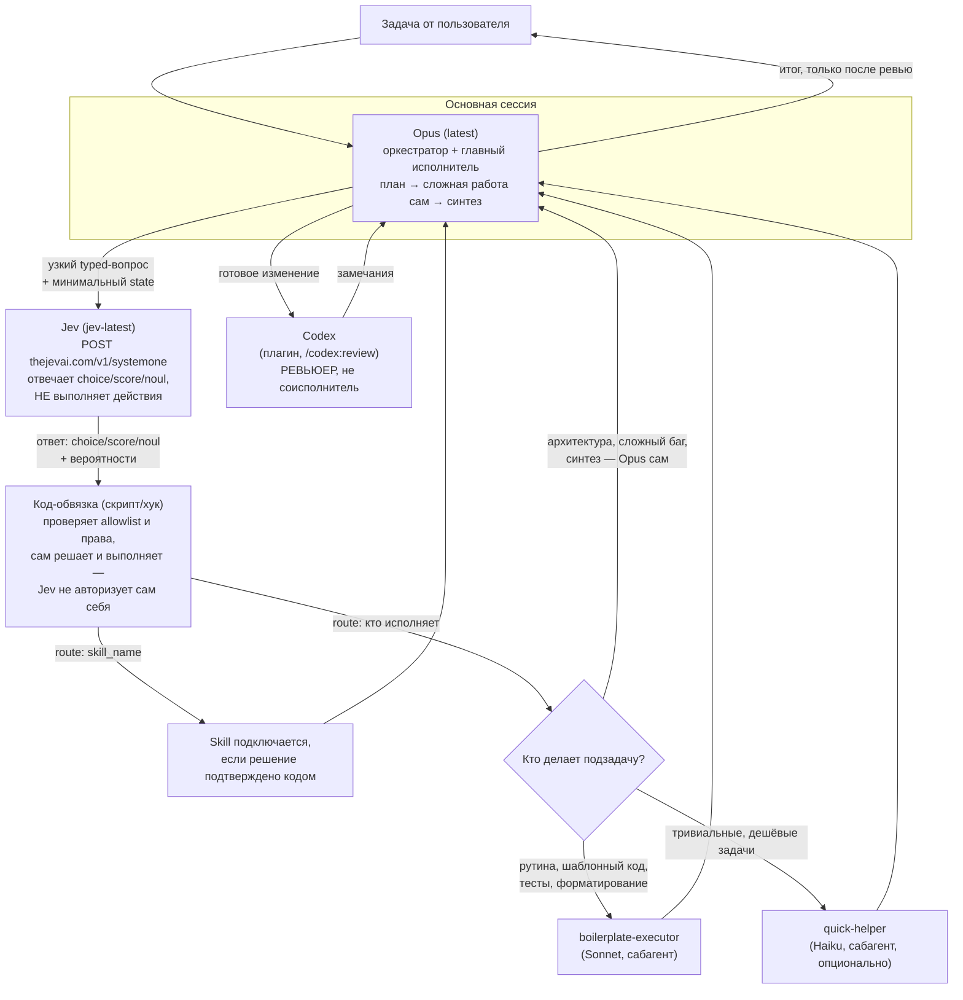

# Opus + Jev + Codex — мультиагентная оркестрация в Claude Code

Готовый рецепт настройки многоагентной работы в **Claude Code**, где:

- **Opus (последняя версия)** — одновременно **оркестратор и главный исполнитель**: сам планирует, сам делает архитектурно значимую и сложную работу, сам синтезирует результат;
- **способные, но более дешёвые модели** (Sonnet, при желании Haiku) в виде сабагентов делают всё остальное — рутину, шаблонный код, тесты, форматирование;
- **Codex** подключён как **ревьюер**, а не как равноправный соисполнитель — проверяет готовые изменения независимым взглядом *после* того, как Opus их сделал;
- **Jev** (TypeSafe `System One`, typed decision-модель, API `thejevai.com/v1/systemone`) используется в трёх местах ради экономии токенов и надёжности — но **только отвечает на узкие вопросы, никогда не авторизует и не исполняет действия сама**:
  1. **маршрутизация моделей** — быстрый (0.1–1.5 c) `choice`-ответ "кто выполняет эту подзадачу: Opus сам / Sonnet / Haiku", вместо того чтобы дорогая модель тратила reasoning на этот выбор;
  2. **маршрутизация skills** — вместо того чтобы держать в контексте оркестратора описания всех доступных skills, атомарный `choice`-вопрос к Jev решает, какой skill (если вообще какой-то) подключить под конкретный запрос;
  3. **гейтинг рискованных вызовов инструментов** — `score`/`noul`-вопрос как один из нескольких контролей перед потенциально опасным `Bash`/`Write`/внешним вызовом; решение и выполнение всё равно за детерминированным кодом.

Это адаптация схемы "Fable-оркестратор + сабагенты + Codex" под другой набор ролей: здесь дорогая модель не только планирует, но и исполняет сложную часть сама, Codex понижен до ревьюера, и добавлен отдельный дешёвый слой принятия решений (Jev) для маршрутизации моделей и skills.

---

## 1. Архитектура



Ключевое отличие от классической схемы "Fable как чистый оркестратор + Opus/Sonnet как сабагенты + Codex как peer":

| | Fable-схема (для справки) | Эта схема (Opus + Jev + Codex) |
|---|---|---|
| Кто оркестрирует | Fable (max reasoning) | Opus (latest) |
| Кто выполняет сложную работу | Сабагент Opus | **Сам оркестратор (Opus)** |
| Кто выполняет рутину | Сабагент Sonnet | Сабагент Sonnet (+ опц. Haiku) |
| Роль Codex | Peer, второе независимое мнение на этапе принятия решения | **Ревьюер** готового кода, после факта |
| Маршрутизация "кто делает" | Решает сама дорогая модель (промптом в CLAUDE.md) | Решает **Jev** — дешёвый typed-decision вызов |
| Маршрутизация skills | Обычный автоматический матчинг Claude Code по `description` | Дополнительно — **Jev-skill-router**, чтобы не держать все описания skills в контексте |

---

## 2. Роли и модели

| Роль | Модель | Где живёт | Задача |
|---|---|---|---|
| Оркестратор + главный исполнитель | **Opus**, последняя версия (например `claude-opus-5-5` — сверяйте актуальный id через `/model`) | основная сессия | Планирует, декомпозирует, **сам делает** архитектурно значимую / сложную / неоднозначную работу, синтезирует финальный результат |
| `boilerplate-executor` | Sonnet | сабагент, `~/.claude/agents/` | Шаблонный код, тесты, форматирование, механические правки + рутинная возня с инструментами (прогон тестов/линтера/сборки, поиск по коду) — возвращает Opus только отфильтрованный вывод, не сырые логи |
| `quick-helper` (опционально) | Haiku | сабагент, `~/.claude/agents/` | Тривиальные дешёвые задачи: поиск по коду, короткие однострочные правки, суммаризация |
| Codex | внешний движок OpenAI, плагин `codex` для Claude Code | `/codex:review`, `/codex:adversarial-review` | **Только ревью** готовых изменений Opus — независимый взгляд, поиск багов/уязвимостей/упущений. Не пишет код, не равноправный соисполнитель |
| Jev | `jev-latest` — API `thejevai.com` (System One, typed decision model) | skill `jev-ai/jev-agent-skill` (`npx skills add`) + скрипты `templates/scripts/jev-route.sh`, `templates/scripts/jev-gate.sh` | Отвечает на узкие типизированные вопросы о текущем состоянии — не выполняет действия и не авторизует их сам |

> **Разделение ролей — ключевой принцип Jev.** LLM (Opus/Sonnet/Haiku) планирует, пишет код, рассуждает. Jev **не генерирует текст** — он отвечает на atomic typed-вопросы трёх видов:
> - `choice` — выбор одного варианта из заданного набора (роутинг: opus-self / boilerplate-executor / quick-helper; proceed / confirm / reject);
> - `score` — упорядоченная шкала `low → critical` (приоритет, серьёзность);
> - `noul` — вероятность, что конкретное утверждение истинно (например, «нужен ли человек для этого вызова?»).
>
> Код-обвязка (скрипт, hook) проверяет права/allowlist и **сам** выполняет или отклоняет действие. Агент может *предложить* действие через Jev-вопрос, но не должен сам себе его разрешать — это не Jev "решает", а детерминированный код на основе ответа Jev плюс собственных проверок.

---

## 3. Предварительные требования

- Установленный и обновлённый Claude Code (`claude doctor` — проверить версию и автообновление).
- Доступ к моделям Opus (latest) и Sonnet (и опционально Haiku) в вашем аккаунте.
- Node.js + npm (нужен для `jev-skill-router` и для Codex CLI).
- Аккаунт и API-ключ **OpenRouter** — https://openrouter.ai/keys (для Jev).
- Установленный `codex` CLI отдельно от Claude Code и логин в нём (для ревью).

---

## 4. Установка шаг за шагом

### 4.1 Модель Opus как основная

```
claude doctor
/model            → выбрать Opus (последнюю доступную версию)
/effort max       → держать max reasoning только на этапе планирования
```

Закрепить на уровне проекта в `.claude/settings.json` (см. готовый пример `templates/settings.json.example` в этом репозитории):

```json
{
  "model": "claude-opus-5-5"
}
```

> Известный баг: встроенное расширение Claude Code для VS Code может игнорировать `model` в project-level `settings.json`. Надёжнее всего это работает через CLI-терминал; если не срабатывает — переключайте `/model` вручную или запускайте `claude` из терминала внутри VS Code.

### 4.2 Сабагенты (глобально, один раз для всех проектов)

Кладутся в `~/.claude/agents/`, а не в `.claude/agents/` внутри проекта — тогда доступны сразу везде. Готовые файлы лежат в `templates/agents/` этого репозитория — скопируйте их:

```bash
mkdir -p ~/.claude/agents
cp templates/agents/boilerplate-executor.md ~/.claude/agents/
cp templates/agents/quick-helper.md ~/.claude/agents/
```

Формат файла — Markdown с YAML frontmatter:

```markdown
---
name: boilerplate-executor
description: Use for mechanical tasks, boilerplate, tests, formatting, simple
  edits. Execute efficiently, without unnecessary re-reasoning.
tools: Read, Write, Edit, Glob, Grep, Bash
model: sonnet
---

You execute clearly-scoped mechanical work delegated by the orchestrator.
Do not re-plan or re-scope the task — follow the instructions given, produce
the change, and return a concise summary of what changed.
```

> Проверяйте фактическое `name:` в получившемся файле — Claude Code иногда создаёт агента не под тем именем, которое вы задумали. Если в CLAUDE.md ссылаетесь на агента по имени — оно должно совпадать один в один с `name` во frontmatter.

### 4.3 Codex — как ревьюер, а не соисполнитель

Сначала сам движок (отдельно от Claude Code):

```bash
npm install -g @openai/codex
codex login
```

Затем плагин-мост в Claude Code:

```
/plugin marketplace add openai/codex-plugin-cc
/plugin install codex@openai-codex
/reload-plugins        ← обязательно, иначе команды /codex:* не появятся
/codex:setup            ← должно показать "Codex is ready"
```

В этой схеме Codex вызывается **только** для ревью, а не для параллельной работы над задачей:

```
/codex:review                 # обычное ревью текущих изменений
/codex:adversarial-review     # более скептичное ревью для критичных изменений
```

Команду `/codex:rescue` (делегирование Codex как равноправному исполнителю) в этой схеме **не используем** — это сознательное отличие от peer-схемы: Codex здесь всегда работает post-hoc, над уже готовым изменением Opus.

### 4.4 Jev — типизированные решения для маршрутизации и гейтинга

Jev — не LLM в привычном смысле. Он не пишет текст и не выполняет действия — он отвечает на узкие типизированные вопросы о переданном ему `state`. Решает и исполняет действие всегда **код-обвязка** (скрипт/хук в Claude Code), а не сам Jev — агент может через Jev *предложить* маршрут или оценку риска, но не имеет права сам себе это разрешить. Это и есть источник экономии токенов: вместо того чтобы дорогая модель рассуждала над routing/triage/gating прозой, атомарный typed-вопрос к Jev даёт структурированный ответ за ~100–1500 мс и на порядки дешевле обычного LLM-вызова.

**Ключ доступа:**

```bash
export JEV_API_KEY=...
export JEV_LANGUAGE=en   # или ru — язык вопросов/ответов
```
(сохраните в `~/.zshrc` / `~/.bashrc` / менеджере секретов вашей ОС; ключ **только** в env на сервере/машине агента — никогда не в промпте, транскрипте сессии или репозитории).

**4.4.1 Skill для coding-агентов (официальный путь)**

```bash
npx skills add jev-ai/jev-agent-skill
```

Даёт Claude Code готовую интеграцию с Jev API без ручного написания HTTP-вызовов для типовых случаев. Настраивается через `JEV_API_KEY` и `JEV_LANGUAGE` из окружения.

**4.4.2 Контракт API**

```
POST https://thejevai.com/v1/systemone
Authorization: Bearer $JEV_API_KEY
Content-Type: application/json

{
  "model": "jev-latest",
  "state": { ... минимальный JSON: суть запроса, предлагаемый tool,
              его аргументы, применимая политика, релевантные улики ... },
  "questions": {
    "<стабильный_ключ_вопроса>": {
      "type": "choice | score | noul",
      ... поля вопроса (options для choice, шкала для score, утверждение для noul) ...
    },
    "<другой_ключ>": { ... }
  }
}
```

Важно из документации/статьи:
- **Каждый вопрос атомарный.** Не "что делать агенту?", а "какой из разрешённых маршрутов подходит?" — вопрос должен соответствовать форме ответа (`choice`/`score`/`noul`), а не быть общим.
- **`state` — минимальный**, а не весь транскрипт: запрос, предлагаемый tool + аргументы, применимая политика, релевантные улики. Не отправляйте историю чата целиком.
- **Несколько вопросов к одному `state` считаются параллельно одним вызовом** — так можно получить `route` + `risk` + `needs_human_review` за один HTTP-запрос вместо трёх.
- **Ключи вопросов держите стабильными** между версиями — иначе логи и метрики (FP/FN, объём ручной проверки) не будут сравнимы.

Точные имена полей ответа (вероятности, формат `choice`/`score`/`noul`) сверяйте с https://thejevai.com/docs — ниже приведена иллюстративная структура запроса/ответа по описанию из статьи, а не гарантированно дословная схема.

> **Альтернативный доступ через OpenRouter-ключ** (без отдельного аккаунта на thejevai.com) — см. подробно раздел 11.5. Коротко: все скрипты в `templates/scripts/` уже поддерживают переключение `JEV_PROVIDER=openrouter` + `OPENROUTER_API_KEY=...` вместо `JEV_API_KEY`.

**4.4.3 Маршрутизация моделей — `jev-route.sh`**

`templates/scripts/jev-route.sh` — атомарный `choice`-вопрос "кто исполняет подзадачу":

```bash
./templates/scripts/jev-route.sh "rename a variable in utils.ts"
# → {"answers":{"route":{"choice":"boilerplate-executor","probability":0.94}}}
```

Оркестратор (Opus) перед делегированием нетривиальной подзадачи вызывает скрипт и:
- при низкой уверенности ответа — решает сам, не полагаясь на Jev;
- иначе следует `choice`: делает сам (`opus-self`) / зовёт `boilerplate-executor` / зовёт `quick-helper`.

**4.4.4 Гейтинг вызовов инструментов — `jev-gate.sh` и порядок проверок**

Для потенциально рискованных вызовов (`Bash`, `Write` в чувствительных путях, внешние API) применяется гардрейл-последовательность **до** выполнения — Jev в ней только шаг 2, не последний и не единственный:

1. Нормализовать имя инструмента и его аргументы.
2. Задать Jev узкий вопрос о риске/необходимости одобрения (`templates/scripts/jev-gate.sh`, `score`+`noul` в одном вызове).
3. Прогнать детерминированные allowlist и проверку прав (код, не Jev).
4. Неясные случаи — на подтверждение пользователю или человеку.
5. Выполнить с idempotency key и записью в аудит-лог.

Для деструктивных и внешних действий должно требоваться согласие **нескольких** контролей, а не один вероятностный порог — политика обязана уметь отклонить действие, даже если Jev вернул уверенный "разрешить".

Политика маршрутизации по итоговому сигналу:

| Сигнал | Действие |
|---|---|
| Уверенно + малый импакт | выполнить автоматически |
| Неоднозначно | запросить дополнительный контекст |
| Высокий импакт или удаление | требовать явное одобрение (человек/подтверждение) |
| Мусорный/некорректный вход | безопасный отказ, без попытки угадать |

**4.4.5 Пороги и аудит-логи**

Пороги (confidence/probability, ниже которых решение эскалируется) подбирайте на исторических и adversarial-примерах, отслеживая false positive / false negative и объём ручной проверки. В аудит-лог пишите: версию вопроса, версию схемы `state`, полный ответ Jev (включая вероятности), итоговое действие кода-обвязки и флаг "решение изменено человеком" — без этого пороги нечем будет калибровать при апдейтах.

**4.4.6 Маршрутизация skills**

Официальный skill (4.4.1) закрывает и этот случай: атомарный `choice`-вопрос с минимальным `state` (текст запроса + список доступных `name`/`description` из `SKILL.md`) вместо того, чтобы оркестратор держал в контексте описания всех skills. Если нужен отдельный готовый CLI под это — есть сторонний проект [`jev-skill-router`](https://github.com/aleksvega/jev-skill-router) (не проверен напрямую в этой сессии из-за сетевых ограничений, трактуйте как community-инструмент, а не первичный источник).

> **Итог по достоверности:** архитектурные принципы (разделение ролей, атомарные typed-вопросы, минимальный `state`, параллельные вопросы, многоконтрольный гейтинг для деструктивных действий) — из официальной статьи и надёжны. Конкретные имена полей запроса/ответа — сверяйте с https://thejevai.com/docs, это community/vendor-пост, а не спецификация API дословно.

---

## 5. `CLAUDE.md` — инструкция оркестратору

Положите в корень проекта (готовый файл — `templates/CLAUDE.md` в этом репозитории):

```markdown
## Orchestration workflow (Opus + Jev + Codex)

You (Opus, latest) are BOTH the orchestrator AND the primary executor.
Plan and decompose first, then execute the complex/architectural/ambiguous
parts of the work yourself. Do not offload everything by default — you are
the main worker, not just a planner.

This is not a one-time split at the start of the task. Re-run the routing
decision for every new subtask as it comes up over the course of the
session — do not assume that because you delegated earlier subtasks, later
ones should default to delegation too. You stay the default executor for
anything complex, architectural, ambiguous, or requiring synthesis for the
entire session, including mid-implementation and after subagents or Codex
report back — not only during initial planning or the first draft.

Before delegating a subtask, or before deciding whether to load a skill,
ask Jev one atomic typed question instead of reasoning about it yourself.
Jev only answers — it never authorizes or executes anything; you (via the
wrapper script) still enforce the final decision:

- Model routing: `templates/scripts/jev-route.sh "<subtask description>"` —
  a `choice` question over {opus-self, boilerplate-executor, quick-helper}.
  Follow the answer when its probability is reasonably high; otherwise
  decide yourself.
- Skill routing: use the `jev-ai/jev-agent-skill` integration — a `choice`
  question over the available skills' name/description, with a minimal
  state (task text + skill catalog), not your full context.
- Tool-call gating for anything risky (`Bash`, `Write` outside the obvious
  scope, external calls): run `templates/scripts/jev-gate.sh` first
  (score + noul in one call), then still apply the deterministic
  allowlist/permission check before executing — never treat a confident
  Jev answer alone as authorization for a destructive or external action.

Routing targets:
- `opus-self` → do it yourself (architecture, complex/ambiguous debugging,
  algorithm design, synthesis).
- `boilerplate-executor` → mechanical work: boilerplate, tests, formatting,
  simple edits, and routine tool babysitting (see below).
- `quick-helper` → trivial, cheap lookups or one-line edits.

Minimize your own raw tool work — not just multi-step subtasks. Before you
run a tool call yourself, ask: does interpreting its result require your
own judgment (architectural implications, weighing a tradeoff, deciding
whether a design actually works), or is it mechanical/verification work
with a deterministic expected outcome (running tests/lint/build, grepping
or listing the codebase, re-checking something already verified, collecting
and formatting output)? Judgment → do it yourself. Mechanical/verification,
however small → delegate to `boilerplate-executor`, even mid-task, even for
a single command. Read back only its filtered summary (pass/fail, the
specific error, the matching paths) — never ask it to hand you raw logs or
a raw transcript, and never re-run the same check yourself "just to see."
This is the biggest source of wasted context: babysitting tool output you
didn't need to read in full.

Codex is a REVIEWER, not a peer or co-executor. After you finish
implementing a non-trivial change, always run `/codex:review` (or
`/codex:adversarial-review` for anything security- or correctness-critical)
before calling the task done. Resolve every finding Codex raises, or state
explicitly why you are not — never silently skip a review finding. Never
delegate primary implementation work to Codex.

Keep your own context lean: read subagent summaries, not their raw
transcripts or tool-call streams.
```

Почему так, а не иначе:

- Явно сказано, что Opus **и планирует, и делает сам** — иначе модель по инерции начнёт делегировать всё подряд, как в чистой Fable-схеме, и вы потеряете смысл "Opus как главный исполнитель".
- Отдельно прописано, что маршрутизация **не разовая на старте**: решение "делегировать или делать самому" принимается заново на каждую новую подзадачу в течение всей сессии. Без этой оговорки модель может по инерции решить, что раз в начале что-то делегировала — дальше можно продолжать делегировать всё не глядя, и превратиться в чистого оркестратора после первого черновика. Opus обязан оставаться основным исполнителем сложных/архитектурных кусков **на всём протяжении** работы, а не только в фазе планирования.
- Добавлена явная эвристика **"raw-возня vs решение, требующее суждения"**: единица делегирования — не только целая подзадача, а любой отдельный вызов инструмента. Если для интерпретации результата не нужно суждение (прогон тестов, grep по коду, повторная проверка) — это уходит в `boilerplate-executor`, даже если это один-единственный вызов посреди работы, и Opus получает обратно только отфильтрованный вердикт, а не сырой лог. Именно тут обычно утекает больше всего контекста дорогой модели впустую — не на "подзадачах", а на пассивном чтении вывода команд, которые сам Opus не обязан был запускать.
- Jev поставлен **перед** делегированием и **перед** подключением skill — именно здесь экономится больше всего токенов: атомарный typed-вопрос вместо reasoning дорогой модели над routing/triage.
- Явно прописано, что **Jev не авторизует действия сам** — итоговое решение и выполнение всегда за детерминированным кодом (allowlist/permission check), особенно для рискованных вызовов. Это прямо из принципа "разделения ролей" в статье: агент предлагает, код проверяет права и исполняет.
- Codex явно назван **ревьюером**, а не peer — прямая противоположность оригинальной инструкции ("treat as a peer, not a reviewer"). Это осознанное изменение под вашу задачу.
- "Resolve every finding... or state explicitly why not" — чтобы ревью не превращалось в ритуал для галочки.
- "Keep your own context lean" — тот же принцип изоляции контекста, что и в исходной схеме.

---

## 6. Как формулировать задачи

Шаблон постановки задачи оркестратору:

```markdown
Цель: [что нужно сделать]

Контекст: [файлы, ограничения]

Ты — Opus, оркестратор и главный исполнитель. Сложную/архитектурную часть
делай сам. Перед делегированием подзадач и перед подключением skill —
задай Jev атомарный typed-вопрос (jev-route.sh / jev-agent-skill); итоговое
решение и рискованные вызовы всё равно проверяй детерминированным кодом,
не полагайся на один ответ Jev. Рутину отдавай boilerplate-executor,
тривиальные задачи — quick-helper. После завершения реализации обязательно
прогони изменения через Codex-ревью (/codex:review или
/codex:adversarial-review) и закрой все замечания.

Сначала покажи мне план, затем приступай к выполнению.
```

Готовый пример — `templates/task-example.md`.

---

## 7. Экономика токенов — решающее дерево

| Ситуация | Что делать | Почему |
|---|---|---|
| Планирование, декомпозиция, синтез нескольких направлений, архитектурное решение | Opus сам, `/effort max` только на этой фазе | Здесь нужна дорогая модель — платите только тут |
| Механическая правка, шаблон, тест, форматирование | Jev → `boilerplate-executor` (Sonnet) | Дешёвая модель справляется не хуже, а стоит на порядок меньше |
| Прогон тестов/линтера/сборки, поиск/листинг по коду, повторная проверка уже проверенного | `boilerplate-executor`, даже для одной команды посреди работы; Opus читает только вердикт | Сырой вывод команд — самый частый источник бесполезно потраченного контекста дорогой модели |
| Тривиальный точечный вопрос / поиск / однострочная правка | Jev → `quick-helper` (Haiku) | Самая дешёвая модель, достаточно для простого случая |
| "Какой skill подключить?" | Jev `choice`-вопрос (jev-agent-skill) вместо ручного анализа оркестратором | ~0.1–1.5с и типизированный ответ вместо reasoning дорогой модели над списком skills |
| "Кто исполняет эту подзадачу?" | `jev-route.sh` (`choice`) вместо решения оркестратором "на глаз" | Тот же порядок экономии, структурированный ответ вместо прозы |
| "Насколько рискован этот вызов инструмента?" | `jev-gate.sh` (`score`+`noul`) + детерминированный allowlist | Быстрый предохранитель до дорогого/необратимого действия, но не единственный контроль |
| Готовое изменение перед тем, как считать задачу законченной | Codex (`/codex:review`) | Ревью не тратит токены Claude, идёт по отдельному лимиту OpenAI/ChatGPT |
| Несвязанные мелкие задачи после основной сессии | Новая сессия на Sonnet напрямую, без оркестратора | Не тащите дорогой Opus-контекст через десятки мелких итераций |

---

## 8. Проверка установки (smoke test)

```bash
claude doctor                              # версия, автообновление
/codex:setup                               # должно быть "Codex is ready"
bash templates/scripts/jev-route.sh "rename a variable in utils.ts"
                                            # ожидаем choice: boilerplate-executor
bash templates/scripts/jev-gate.sh "rm -rf build/" "Bash"
                                            # ожидаем высокий score/noul → эскалация
```

Если всё возвращает осмысленный JSON без ошибок авторизации — установка готова. Дальше — реальная задача по шаблону из раздела 6, с обязательным "сначала покажи мне план".

---

## 9. Частые ошибки

- **Несовпадение имён сабагентов.** В `CLAUDE.md` и в `jev-route.sh` должны быть ровно те имена, что в `name:` файлов сабагентов (`boilerplate-executor`, `quick-helper`). Разошлись — оркестратор либо не найдёт агента, либо Jev-маршрутизация укажет на несуществующую цель.
- **Codex используется как peer, а не ревьюер.** Если случайно начать звать `/codex:rescue` вместо `/codex:review` — вы вернётесь к peer-схеме и потеряете смысл разделения ролей из этого документа.
- **Забыли `/reload-plugins`** после установки плагина Codex — без этого шага `/codex:*` команды не появятся.
- **Нет `JEV_API_KEY`** — `jev-agent-skill`, `jev-route.sh` и `jev-gate.sh` откажут с ошибкой авторизации. Переменная должна быть в окружении именно той сессии/терминала, откуда стартует Claude Code.
- **Opus делегирует вообще всё.** Если в CLAUDE.md не прописано явно "you are the primary executor, not just a planner" — модель по умолчанию скатывается в чисто оркестраторское поведение (как Fable в исходной схеме) и не делает сложную работу сама.
- **Jev используется как единственный источник истины для рискованных решений.** Это прямое нарушение принципа из статьи: Jev только отвечает на typed-вопрос, решение и выполнение — всегда за детерминированным кодом (allowlist, проверка прав). Для деструктивных/внешних действий нужно согласие нескольких контролей, а не один вероятностный порог от Jev.
- **В `state` для Jev передаётся весь транскрипт/история сессии.** Так теряется и экономия, и предсказуемость — `state` должен быть минимальным JSON (суть запроса, предлагаемый tool и аргументы, политика, улики).
- **Ключи вопросов меняются между версиями промпта.** Тогда логи/метрики (FP/FN, доля эскалаций) не сравнить между итерациями — держите ключи вопросов стабильными.
- **VS Code extension игнорирует `model` в project `settings.json`.** Известный баг — переключайте модель вручную через `/model` или запускайте `claude` из терминала.
- **Держите `/effort max` весь день на Opus.** Дорого и не нужно вне этапа планирования — понижайте эффорт или переходите на прямой вызов Sonnet для мелких несвязанных правок.

---

## 10. Структура этого репозитория

```
README.md                          — этот файл, полная инструкция
templates/CLAUDE.md                — готовый блок для CLAUDE.md проекта
templates/settings.json.example    — project-level settings.json с моделью Opus
templates/agents/boilerplate-executor.md
templates/agents/quick-helper.md
templates/scripts/jev-route.sh     — Jev choice-вопрос: кто исполняет подзадачу (bash/WSL/macOS/Linux)
templates/scripts/jev-gate.sh      — Jev score+noul: гейтинг рискованных вызовов (bash/WSL/macOS/Linux)
templates/scripts/jev-route.ps1    — то же самое, нативный PowerShell для Windows без WSL
templates/scripts/jev-gate.ps1     — то же самое, нативный PowerShell для Windows без WSL
templates/task-example.md          — пример постановки задачи оркестратору
```

---

## 11. Установка Jev — подробно (в общем и отдельно для Windows)

### 11.1 Что вообще нужно, независимо от ОС

1. **Аккаунт и ключ API.** Зайдите на https://thejevai.com, зарегистрируйтесь/войдите, в разделе API keys создайте ключ. Это и есть значение `JEV_API_KEY`.
   > Сам домен `thejevai.com` недоступен из моей текущей сессии (заблокирован сетевой прокси окружения), поэтому точный путь в интерфейсе (название пунктов меню) я не проверял вживую — но раздел с API-ключами есть у любого такого сервиса, ищите "API keys" / "Developers" в настройках аккаунта.
2. **Node.js + npm** — нужен, чтобы поставить официальный skill для coding-агентов:
   ```
   npx skills add jev-ai/jev-agent-skill
   ```
   `npx` идёт в комплекте с Node.js, отдельно ставить не нужно.
3. **Способ делать HTTPS-запросы** — для собственных скриптов маршрутизации/гейтинга (`jev-route.*`, `jev-gate.*` из `templates/scripts/`): либо `curl` (Linux/macOS/WSL/Git Bash), либо `Invoke-RestMethod` (нативный PowerShell на Windows — в репозитории уже есть готовые `.ps1`-версии, curl не нужен).
4. **Переменные окружения:**
   - `JEV_API_KEY` — обязательно;
   - `JEV_LANGUAGE` — опционально, язык вопросов/ответов (`en`/`ru` и т.д.), по умолчанию можно не задавать.
5. **Claude Code** уже должен быть установлен (см. раздел 4) — skill `jev-ai/jev-agent-skill` интегрируется именно в него.

Общая последовательность одинакова на любой ОС: получить ключ → поставить Node.js → `npx skills add jev-ai/jev-agent-skill` → выставить `JEV_API_KEY` (и опц. `JEV_LANGUAGE`) в окружении → проверить тестовым вызовом.

### 11.2 Windows — вариант А: WSL2 (рекомендуется)

Самый надёжный путь: внутри WSL2 всё работает так же, как в Linux/macOS-инструкциях выше (bash-скрипты `jev-route.sh`/`jev-gate.sh`, `curl`, `python3` — без адаптаций).

1. **Включить WSL2.** Откройте PowerShell **от имени администратора** и выполните:
   ```powershell
   wsl --install
   ```
   Это включит нужные компоненты Windows, поставит WSL2 и дистрибутив Ubuntu по умолчанию. Требуется перезагрузка. (Windows 10 версии 2004+ или Windows 11; если `wsl --install` ругается на версию — обновите Windows через "Параметры → Центр обновления".)
2. После перезагрузки Ubuntu запустится автоматически (или через меню "Пуск → Ubuntu") — задайте UNIX-логин и пароль (свои, не от Windows).
3. Внутри WSL/Ubuntu поставьте Node.js (через `nvm`, чтобы не зависеть от старой версии в apt):
   ```bash
   curl -o- https://raw.githubusercontent.com/nvm-sh/nvm/v0.40.1/install.sh | bash
   source ~/.bashrc
   nvm install --lts
   node -v && npm -v
   ```
4. Python 3 и `curl` в Ubuntu обычно уже установлены; если нет:
   ```bash
   sudo apt update && sudo apt install -y python3 curl
   ```
5. Поставьте Claude Code внутри WSL (см. официальную инструкцию для актуальной команды установки — на момент написания это npm-пакет, например `npm install -g @anthropic-ai/claude-code`; сверьтесь с текущей документацией Claude Code, если команда не сработает).
6. Склонируйте репозиторий **внутри WSL** (не в `/mnt/c/...`, если важна скорость файловой системы, хотя `/mnt/c/...` тоже будет работать):
   ```bash
   git clone https://github.com/Lightwell-bg/agents_cc_codex.git
   cd agents_cc_codex
   ```
7. Поставьте skill и выставьте ключ:
   ```bash
   npx skills add jev-ai/jev-agent-skill
   echo 'export JEV_API_KEY="ваш-ключ"' >> ~/.bashrc
   echo 'export JEV_LANGUAGE=ru' >> ~/.bashrc
   source ~/.bashrc
   ```
8. Проверка:
   ```bash
   chmod +x templates/scripts/*.sh
   bash templates/scripts/jev-route.sh "rename a variable in utils.ts"
   ```
9. Если параллельно правите файлы из Windows-редактора (VS Code) — установите расширение **WSL** для VS Code и открывайте папку командой `code .` прямо из терминала WSL внутри клонированной папки: VS Code подключится к WSL-окружению, а редактируете вы всё равно в привычном Windows-интерфейсе.

### 11.3 Windows — вариант Б: нативно, без WSL (PowerShell)

Если WSL ставить не хочется — используйте `.ps1`-версии скриптов, которые уже лежат в `templates/scripts/` (`jev-route.ps1`, `jev-gate.ps1`) и не требуют ни `curl`, ни `python3`.

1. **Node.js для Windows.** Скачайте LTS-инсталлятор с https://nodejs.org, поставьте с настройками по умолчанию (галочка "Add to PATH" уже включена). Проверьте в новом окне PowerShell:
   ```powershell
   node -v
   npm -v
   ```
2. **Git для Windows** (нужен для `git clone`/`git pull`/`git push`, если ещё не ставили) — https://git-scm.com/download/win.
3. **Клонировать репозиторий:**
   ```powershell
   cd C:\Users\ВашеИмя\Projects
   git clone https://github.com/Lightwell-bg/agents_cc_codex.git
   cd agents_cc_codex
   ```
4. **Поставить skill:**
   ```powershell
   npx skills add jev-ai/jev-agent-skill
   ```
5. **Выставить переменные окружения.** Два варианта:
   - Только на текущую сессию PowerShell:
     ```powershell
     $env:JEV_API_KEY = "ваш-ключ"
     $env:JEV_LANGUAGE = "ru"
     ```
   - Постоянно (сохранится между перезапусками терминала/компьютера):
     ```powershell
     setx JEV_API_KEY "ваш-ключ"
     setx JEV_LANGUAGE "ru"
     ```
     После `setx` откройте **новое** окно PowerShell — в уже открытом переменная не появится.
6. **Разрешить запуск `.ps1`-скриптов** (по умолчанию Windows блокирует запуск непод­писанных PowerShell-скриптов):
   ```powershell
   Set-ExecutionPolicy -Scope CurrentUser -ExecutionPolicy RemoteSigned
   ```
   Скажет "Да" на подтверждение — это разрешает запуск локальных скриптов только для вашего пользователя, безопасно для личной машины. Альтернатива без изменения политики глобально — запускать каждый раз с обходом:
   ```powershell
   powershell -ExecutionPolicy Bypass -File .\templates\scripts\jev-route.ps1 "rename a variable in utils.ts"
   ```
7. **Проверка:**
   ```powershell
   .\templates\scripts\jev-route.ps1 "rename a variable in utils.ts"
   .\templates\scripts\jev-gate.ps1 -ProposedArguments "rm -rf build/" -ToolName "Bash"
   ```
   Ожидается JSON-ответ от Jev (route/risk/needs_human_review) без ошибок авторизации.

### 11.4 Частые проблемы на Windows

- **`wsl --install` ничего не делает / ошибка версии.** Обновите Windows до актуальной версии через "Параметры → Центр обновления Windows", затем повторите. Также нужна включённая виртуализация в BIOS/UEFI (на большинстве современных ПК включена по умолчанию).
- **`node`/`npm` не найден после установки.** Установщик Node.js меняет PATH только для новых окон терминала — закройте и заново откройте PowerShell/терминал VS Code.
- **`Invoke-RestMethod`/`curl` в PowerShell ведут себя странно.** В Windows PowerShell (не PowerShell 7+) `curl` — это алиас на `Invoke-WebRequest`, а не настоящий curl, и синтаксис флагов другой. Используйте готовые `.ps1`-скрипты из этого репозитория (`Invoke-RestMethod`) вместо ручного набора `curl`-команд из bash-примеров — они для разных сред не взаимозаменяемы 1-в-1.
- **Скрипт `.ps1` не запускается: "cannot be loaded because running scripts is disabled".** Это `ExecutionPolicy` — см. шаг 6 в 11.3 (`Set-ExecutionPolicy` или запуск через `-ExecutionPolicy Bypass`).
- **`JEV_API_KEY` не подхватывается.** Через `$env:JEV_API_KEY = "..."` переменная живёт только в текущем окне терминала — закрыли окно, потеряли значение. Для постоянного значения нужен `setx` (и новое окно после него), либо задавайте `$env:JEV_API_KEY` в начале каждой сессии/в профиле PowerShell (`$PROFILE`).
- **Антивирус/корпоративный прокси блокирует `npm install`/`npx`.** Частая история на корпоративных Windows-машинах — проверьте настройки прокси в `npm config`, либо согласуйте с администратором сети доступ к `registry.npmjs.org`.

### 11.5 Альтернатива: доступ к Jev через OpenRouter-ключ

Если у вас уже есть аккаунт OpenRouter (используете его для других моделей) и не хочется заводить отдельный ключ на thejevai.com — Jev доступен и через OpenRouter, под тем же принципом typed-вопросов.

**Получить ключ:**
1. Зайдите на https://openrouter.ai, зарегистрируйтесь/войдите.
2. Пополните баланс (OpenRouter работает по предоплате/pay-as-you-go — под конкретную модель).
3. В разделе **Keys** (https://openrouter.ai/keys) создайте API-ключ — он будет в формате `sk-or-v1-...`.

**Как использовать в скриптах из этого репозитория:**

Все скрипты (`jev-route.sh`, `jev-gate.sh`, `jev-route.ps1`, `jev-gate.ps1`) поддерживают переключение провайдера через переменную `JEV_PROVIDER`:

```bash
# bash / WSL / Git Bash
export JEV_PROVIDER=openrouter
export OPENROUTER_API_KEY=sk-or-v1-...
bash templates/scripts/jev-route.sh "rename a variable in utils.ts"
```

```powershell
# PowerShell (Windows)
$env:JEV_PROVIDER = "openrouter"
$env:OPENROUTER_API_KEY = "sk-or-v1-..."
.\templates\scripts\jev-route.ps1 "rename a variable in utils.ts"
```

По умолчанию (`JEV_PROVIDER` не задан = `direct`) скрипты идут напрямую в `thejevai.com` с `JEV_API_KEY`. При `JEV_PROVIDER=openrouter` они идут в `https://openrouter.ai/api/v1/systemone` с `OPENROUTER_API_KEY` и моделью `typesafe/jev-latest` (можно переопределить точный слаг модели переменной `JEV_MODEL`, например `typesafe/jev-1.13` под конкретную закреплённую версию).

> **Важная оговорка по достоверности.** `openrouter.ai` был недоступен из моей текущей сессии (заблокирован сетевой прокси окружения), поэтому путь `/api/v1/systemone` и слаг модели `typesafe/jev-latest` я не проверял вживую — это по описанию из вторичных источников ("OpenRouter serves Jev... at `/api/v1/systemone` or `/api/alpha/decisions`, different wire formats"). Перед боевым использованием:
> 1. Откройте https://openrouter.ai/typesafe — там актуальный список моделей Jev и их точные id (например `typesafe/jev-1.13` или `~typesafe/jev-latest`).
> 2. Сверьтесь с https://openrouter.ai/docs/guides/community/jev на предмет точного пути эндпоинта и формата ответа.
> 3. Если `/api/v1/systemone` вернёт 404 — на OpenRouter задокументирован рабочий альтернативный путь, **Decisions API** (`POST https://openrouter.ai/api/alpha/decisions`), но у него **другой формат запроса/ответа** (не `{state, questions}` с `choice`/`score`/`noul`, а свой JSON-контракт) — скрипты из этого репозитория под него не заточены, их нужно будет адаптировать отдельно, если решите использовать именно Decisions API.

**Когда какой провайдер выбрать:**

| Ситуация | Провайдер |
|---|---|
| Уже есть/заводите отдельный аккаунт thejevai.com | `direct` (по умолчанию) — самый прямой путь, минимум прослоек |
| Уже платите за OpenRouter, не хочется второй биллинг | `openrouter` — но сверьте актуальный model id/эндпоинт перед стартом (см. оговорку выше) |
| Нужна привязка к конкретной версии модели, а не "latest" | Задайте `JEV_MODEL` явно (например `jev-1.13` для `direct` или `typesafe/jev-1.13` для `openrouter`) |

---

## 12. Источники

Первичный источник по API и принципам (используйте как основной ориентир):

- [Jev AI API & AI Agents: A Practical Guide to Reliable Agent Workflows](https://huggingface.co/blog/sora-2/jev-ai-api-ai-agents-a-practical-guide-to-reliable) — эндпоинт `POST https://thejevai.com/v1/systemone`, модель `jev-latest`, три типа вопросов (`choice`/`score`/`noul`), минимальный `state`, параллельные вопросы в одном вызове, 5-шаговый гардрейл-порядок, политика многоконтрольного одобрения для деструктивных действий, логирование версий/вероятностей.
- [thejevai.com/docs](https://thejevai.com/docs) — официальная документация, сверяйте точные имена полей запроса/ответа перед использованием в проде (не проверено напрямую в этой сессии из-за сетевых ограничений).

Вторичные/community-источники (использовались для установки и общего контекста, могут расходиться с официальным API в деталях):

- [What Is Jev? TypeSafe's Decision Model Explained for Developers — OpenRouter Blog](https://openrouter.ai/blog/insights/what-is-jev/)
- [jev-skill-router — Jev-powered skill router & security auditor](https://github.com/aleksvega/jev-skill-router)
- [jev-skill (KHAEntertainment) — Claude Code plugin for Jev integration](https://github.com/KHAEntertainment/jev-skill)
